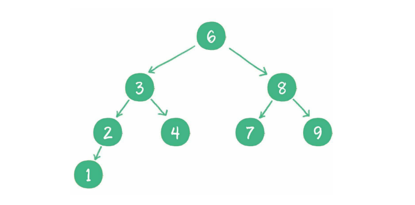

## 树

树是n(n≥0)个节点的有限集。当n=0时，称为空树。在任意一个非空树中，有如下特点：

1. 有且仅有一个特定的称为根的节点
2. 当n>1时，其余节点可分为m（m>0）个互不相交的有限集，每一个集合本身又是一个树，并称为根的子树

二叉树是树的特殊形式，这种树的每个节点最多有2个孩子节点。

**满二叉树**：一个二叉树的所有非叶子节点都存在左右两个孩子，并且所有叶子节点都在同一层上。满二叉树的每一个分支都是满的

**完全二叉树**：对于一个有n个节点的二叉树，按层级顺序编号，则所有节点的编号为从1到n。如果这个树所有节点和同样深度的满二叉树的编号为从1到n的节点位置相同，则这个二叉树为完全二叉树。

二叉树属于逻辑结构，可以用以下物理存储结构来表达：

- 链式存储结构

  

- **数组存储结构**

  

数组结构存储二叉树，可以方便的在数组中定位二叉树的孩子节点和父节点：

- 若某一个父节点的下标为**`parent`**，那么它的左孩子节点下标就是**`2 * parent + 1`**，右孩子节点下标就是**`2 * parent + 2`**
- 若某个左孩子节点下标为**`leftChild`**，那么它的父节点下标就是**`(leftChild - 1) / 2`**

二叉树的应用：

1. 查找
2. 维持相对顺序

**二叉查找树（二叉排序树）**：

- 如果左子树不为空，则左子树上所有节点的值均小于根节点的值
- 如果右子树不为空，则右子树上所有节点的值均大于根节点的值
- 左右子树也都是二叉查找树

**二叉树的遍历**：

1. 深度优先遍历（前序遍历、中序遍历、后序遍历）
2. 广度优先遍历（层序遍历）

