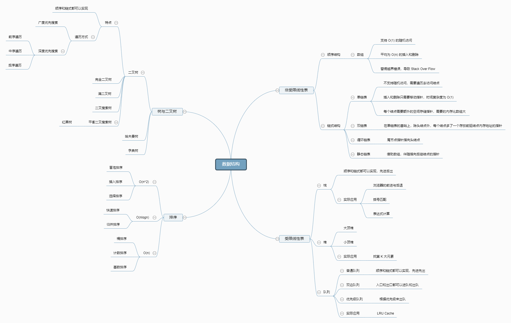

## 第一天

**数据结构脑图**

**算法脑图**

**学习方法**：

- 切碎知识点

- 刻意练习

- 反馈

**五遍刷题法**：

- 想思路，看别人的解法
- 马上自己写
- 过一天，自己写（LeetCode国际站）
- 过一周，自己写（LeetCode国际站）
- 面试前一周进行恢复训练

《异类》

## 第二天

**工具**：

Google

MiCroSoft Terminal

Visual Code、Intellij Idea（LeetCode Plugin）

**代码风格**：

Google Java style guide

**指法**：

Top tips for idea

***自顶向下的编程方式：先写主干，再写细节***

**常见时间复杂度**

O(1)

O(log n)

O(n)

O(n ^ 2)

O(n ^ 3)

O(2 ^ n)

O(n!)

递归： K ^ n 

二分查找算法：O(log n)

二叉搜素树：O(n)

有序二维矩阵查找： O(n)

归并排序：O(n log n)

