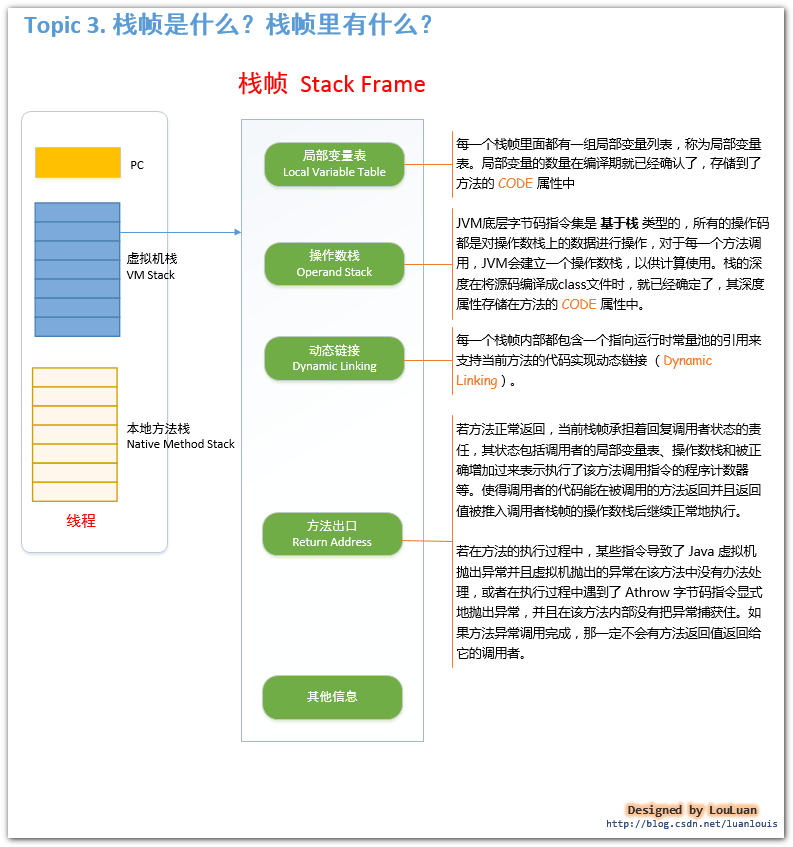

# JVM
## 一、自动内存管理机制

Java与C++之间的区别
- 内存动态分配
- 垃圾收集技术

### 1.1 运行时数据区域

Java虚拟机在执行Java程序的过程中会把它所管理的内存划分为若干个不同的数据区域，这些区域都有 ***各自的用途*** ，以及 ***创建和销毁的时间*** ，***有的区域随着虚拟机进程的启动而存在，有些区域则是依赖用户线程的启动和结束而建立和销毁***。

#### 1.1.1 程序计数器
- ***较小的、线程私有***的内存空间，***用来存储当前线程所执行的字节码的行号指示器***
- 字节码解释器工作时就是通过改变这个计数器的值来选取下一条需要执行的字节码指令，分支、循环、跳转、异常处理、线程恢复等基础功能都需要依赖这个计数器完成
- 若线程执行的是一个Java方法，则记录的是正在执行的虚拟机字节码指令的地址
- 若正在执行的是Natvie方法，则这个计数器值为空
- 唯一一个在Java虚拟机规范中没有规定任何`OutOfMemoryError`情况的区域

#### 1.1.2 Java虚拟机栈
- ***线程私有，生命周期与线程相同***
- 描述的是Java方法执行的内存模型：每个方法被执行时都会创建一个栈帧，用于存储局部变量表、操作栈、动态链接、方法出口等信息。每一个方法被调用直至执行完成的过程，就对应一个栈帧在虚拟机栈中从入栈到出栈的过程
- 局部变量表存储了编译器可知的各种基本数据类型、对象引用类型。***局部变量表所需的内存空间在编译期间完成分配***，当进入一个方法时，这个方法需要在帧中分配多大的局部变量空间是完全确定的，在方法运行期间不会改变局部变量表的大小
- ***如果线程请求的栈深度大于虚拟机所允许的深度，将抛出`StackOverflowError`异常***
- ***如果虚拟机栈可以动态扩展，当扩展时无法申请到足够的内存时会抛出`OutOfMemoryError`异常***

#### 1.1.3 本地方法栈
- 与Java虚拟机栈所发挥的作用非常相似，区别是，Java虚拟机栈是虚拟机执行Java方法服务，本地方法栈则是为虚拟机使用的Native方法服务
- 本地方法栈也会抛出`StackOverflowError`和`OutOfMemoryError`异常

#### 1.1.4 Java堆
- Java虚拟机管理的最大的一块内存
- 线程共享
- 虚拟机启动时创建
- 此内存区域的唯一目的就是存放对象实例，几乎所有的对象实例都在这里分配。为什么说几乎，因为随着虚拟机的一些优化，所有的对象都分配在堆上就逐渐变得不是那么绝对了
- Java堆可处于物理上不连续的内存空间中，只要逻辑上连续即可
- 大部分虚拟机的堆都是可扩展的，当内存不足，堆中没有内存完成实例分配时，会抛出`OutOfMemoryError`异常

#### 1.1.5 方法区
- 方法区与堆一样，也是***各个线程共享的内存区域***
- 用于存储已被虚拟机加载的***类信息、常量、静态变量、即时编译器编译后的代码等数据***
- 有时候又称为***永久代***，但实际上并不永久，这个区域的内存回收目标主要是针对常量池的回收和类型的卸载，方法区内存回收的效果是比较低的，但是却很有必要，因为曾经发生过该区域未完全回收导致的内存泄漏
- 不需要连续的内存、可选择固定大小也可扩展、也可以不实现垃圾回收
- 当方法区无法满足内存分配需求时，将抛出`OutOfMemoryError`异常

#### 1.1.6 运行时常量池
- ***方法区的一部分***
- Class文件除了类的版本、字段、方法、接口等描述信息外，还有一项信息时常量池，用于存放编译期生成的各种字面量和符号引用，这部分将在类加载后存放到方法区的运行常量池中
- 运行时常量池与Class文件的常量池的另外一个重要特征是具备***动态性***。因为程序运行期间也可能将新的常量放入池中，如String类的intern()方法
- 当运行时常量池无法申请到内存时会抛出`OutOfMemoryError`异常

#### 1.1.7 直接内存
- 不是虚拟机运行时数据区的一部分，也不是Java虚拟机规范中定义的内存区域，但是这部分内存也被频繁使用，可能导致`OutOfMemoryError`异常
- 如Java中的NIO类，引入了一种基于通道与缓冲区的I/O方式，可以使用Native函数库直接分配堆外内存

###  1.2 对象访问
Java中对象访问有两种主流方式：
- **使用句柄访问方式**，会在Java堆中划分出一块内存用来作为句柄池，`reference`中存储的就是对象的句柄地址，句柄中包含了对象实例数据和类型数据各自的具体地址信息

- 使用直接指针访问方式，`reference`中直接存储的就是对象地址

两种方式各有优势：
- 使用句柄方式，`reference`中存储的是稳定的句柄地址，在对象被移动时只会改变句柄中的实例数据指针，而`reference`本身不需要被修改
- 直接指针访问方式，速度快，节省了一次指针定位的时间开销，主要虚拟机`Sun HotSpot`就是用的直接指针访问

## 二、垃圾收集器与内存分配策略

垃圾收集（GC）需要完成的三件事情：
- 哪些内存需要回收
- 什么时候回收
- 如何回收

程序计数器、虚拟机栈、本地方法栈三个区域随线程而生，随线程而灭。栈帧随方法进入和退出而入栈和出栈，栈帧分配多少内存在编译期基本就是已知的。所以这几个区域的内存分配和回收都具备确定性。

Java堆和方法区不一样，这部分区域的内存分配和回收都是动态的，垃圾收集器所关注的都是这部分内存。

### 2.1 如何确定对象已死呢

#### 2.1.1 引用计数算法
给对象中添加一个引用计数器，每当有一个地方引用它时，计数器值就加1；当引用失效时，计数器值就减1；任何时刻，计数器都为0的对象就是不可能再被使用的。

**缺点：**  
无法解决对象之间的相互引用问题

#### 2.1.2 根搜索算法
通过一系列的名为“GC Roots”的对象作为起始点，从这些节点开始向下搜索，搜索所走过的路径称为引用链，当一个对象到`GC Roots`没有任何引用链相连时，则证明此对象是不可用的。Java语言使用的就是根搜索算法

可以作为`GC Roots`的对象包括以下几种：
- 虚拟机栈（栈帧中的本地变量表）中的引用对象
- 方法区中的类静态属性引用的对象
- 方法区中常量引用的对象
- 本地方法栈中JNI（即一般所说的Native方法）的引用的对象

#### 2.1.3 Java中的引用
Java中的引用分为四种：
- 强引用——代码中普遍存在，类似`Object obj = new Object()`，只要强引用还在，垃圾收集器永远不会回收掉被引用的对象
- 软引用——用来描述一些还有用，但并非必需的对象。对于软引用关联着的对象，在系统将要发生内存溢出异常之前，将会把这些对象列进回收范围之中并进行第二次回收，如果这次回收还是没有足够的内存，才会抛出内存溢出异常。`SoftReference`类来实现软引用
- 弱引用——描述非必需对象，被弱引用关联的对象只能生存到下一次垃圾收集发生之前。当垃圾收集器工作时，无论当前内存是否足够，都会回收掉只被弱引用关联的对象。`WeakReference`类来实现弱引用
- 虚引用——最弱的一种引用关系。一个对象是否有虚引用的存在，完全不会对其生存时间构成影响，也无法通过虚引用来取得一个实例对象。当一个对象设置虚引用关联的位移目的就是希望能在这个对象被收集器回收时收到一个系统通知。`PhantomReference`类来实现虚引用

#### 2.1.4 finalize()方法

一个对象真正的死亡，至少要经历两次标记过程：如果对象在经历根搜索后发现没有与`GC Roots`相连接的引用链，那它将被第一次标记并且进行一次筛选，筛选的条件是此对象是否有必要执行`finalize()`方法。当对象没有覆盖`finalize()`方法或者`finalize()`方法已经被虚拟机调用过，虚拟机将这两种情况都视为“没有必要执行”。如果这个对象被判定为有必要执行`finalize()`方法，那么这个对象将会被放置在一个名为`F-Queue`的队列中，并在稍后由一条由虚拟机自动建立的、低优先级的`Finalize`线程去执行。

#### 2.1.5 方法区的回收
- 方法区（永久代）的垃圾收集主要回收***废弃常量***和***无用的类***，回收性价比较低
- 回收废弃常量与回收Java堆中的对象非常相似，也是通过引用来判断常量是否有用，如果没用，就会被回收
- 判断一个类是否是无用的类，需要满足以下三个条件：
    - 该类所有的实例已经被回收
    - 加载该类的`ClassLoader`已经被回收
    - 该类对应的`java.lang.Class`对象没有任何地方被引用，无法在任何地方通过反射访问该类的方法
- 类的回收，除满足以上三个条件，还需要根据虚拟机相关参数`-Xnoclassgc`来判断
- 在大量使用反射、动态代理、CGLib等框架的场景下，都需要虚拟机具备类卸载的功能，保证永久代不会溢出

### 2.2 垃圾收集算法

#### 2.2.1 标记-清除算法
算法分为“标记”和“清除”两阶段：首先标记出需要回收的对象，在标记完成后同一回收掉所有被标记的对象

缺点：
- 标记和清除过程的效率都不高
- 标记清除之后会产生大量不连续的内存碎片

#### 2.2.2 复制算法
将可用内存按容量分为大小相等的两块，每次只使用其中一块。当这一块的内存用完了，就将还存活着的对象复制到另一块上面，然后再已使用过的内存空间一次清理掉。

目前的商业虚拟机都采用这种收集算法来回收新生代，将内存分为一块较大的`Eden`空间和两块较小的`Survivor`空间，每次使用`Eden`和其中的一块`Survivor`，大小比例为8:1。当`Survivor`空间不够用时，需要依赖其他内存（老年代）进行分配担保。

优点：
- 实现简单、运行高效

缺点：
- 代价高，将可用内容缩小为原先的一半

#### 2.2.3 标记-整理算法
标记-整理算法适用于老年代的内存回收，标记过程仍然与标记-清理算法一致，但后续步骤不是直接对可回收对象进行清理，而是让所有存活的对象都向一端移动，然后直接清理掉端边界以外的内存。

#### 2.2.4 分代收集算法
- 新生代——复制算法
- 老年代——标记清理或标记整理算法

### 2.3 垃圾收集器

#### 2.3.1 Serial 收集器

**特点：**
- 针对新生代
- 采用复制算法
- 单线程收集
- 进行垃圾收集时，必须暂停所有工作线程，直到完成，即`Stop The World`

**应用场景： ** 
依然是HotSpot在Client模式下默认的新生代收集器

**特点：**
- 对于限定单个CPU的环境来说，Serial收集器没有线程交互（切换）开销，可以获得最高的单线程收集效率；
- 在用户的桌面应用场景中，可用内存一般不大（几十M至一两百M），可以在较短时间内完成垃圾收集（几十MS至一百多MS）,只要不频繁发生，这是可以接受的

**Serial/Serial Old组合收集器运行示意图如下：**

#### 2.3.2 ParNew收集器

**特点：**
- 除多线程外，与Serial一样

**应用场景：**
- 在Server模式下，ParNew收集器是一个非常重要的收集器，因为除Serial外，目前只有它能与CMS收集器配合工作；
- 但在单个CPU环境中，不会比Serail收集器有更好的效果，因为存在线程交互开销。

**ParNew/Serial Old 组合收集器运行示意图：**

#### 2.3.3 Parallel Scavenge收集器

**特点：**
- 也称为吞吐量收集器
- 新生代收集器
- 采用复制算法
- 多线程收集

**应用场景：**
- 高吞吐量为目标，即减少垃圾收集时间，让用户代码获得更长的运行时间
- 当应用程序运行在具有多个CPU上，对暂停时间没有特别高的要求时，即程序主要在后台进行计算，而不需要与用户进行太多交互。如：执行批量处理、订单处理、工资支付、科学计算的应用程序

#### 2.3.4 Serial Old收集器

**特点：**
- Serial收集器的老年代版本
- 采用标记-整理算法（还有压缩，Mark-Sweep-Compact）
- 单线程收集

**应用场景：**
- 主要用于Client模式

**Serial/Serial Old收集器运行示意图如下：** 

#### 2.3.5 Paraller Old收集器

**特点：**
- Paraller Old垃圾收集器是`Paraller Scavenge`收集器的老年代版本
- 标记-整理算法
- 多线程收集

**应用场景：**
- JDK1.6及以后用来代替老年代的Serial Old收集器
- Server模式，多CPU模式下
- 注重吞吐量以及CPU资源敏感的场景

**Paraller Scavenge/Paraller Old收集器运行示意图如下：**

#### 2.3.6 CMS收集器

并发标记清理（Concurrent Mark Sweep, CMS）收集器也称为并发低停顿收集器或低延迟垃圾收集器

**特点：**
- 针对老年代
- 标记清除算法（产生内存碎片）
- 以获取最短回收停顿时间为目标
- 并发收集、低停顿
- 需要更多的内存

**应用场景：**
- 与用户交互较多的场景
- 希望系统停顿时间最短，注重服务的响应速度
- 常见WEB、B/S系统的服务器上的应用

**CMS收集器运作过程：**
1. 初始标记  
    仅标记一下`GC Roots`能直接关联到的对象，速度很快，但需要`Stop The World`
2. 并发标记  
    进行`GC Roots Tracing`的过程，刚才产生的集合中标记出存活对象，应用程序也在运行，并不能保证可以标记出所有的存活对象
3. 重新标记  
    为了修正并发标记期间因用户程序继续运行而导致标记变动的那一部分对象的标记记录；需要`Stop The World`，且停顿时间比初始标记稍长，但远比并发标记短；采用多线程并发执行来提升效率
4. 并发清除  
    回收所有垃圾对象

**缺点：**
- 对CPU资源非常敏感  
    并发收集虽不会暂停用户线程，但因为占用一部分CPU资源，还是会导致应用程序变慢，总吞吐量降低。CMS默认并发收集线程数量=（CPU数量+3）/4；当CPU数量多于4个，收集线程占用的CPU资源多于25%，对用户程序影响可能较大；不足4个时，影响更大
- 无法处理浮动垃圾，可能出现`Concurrent Mode Failure`失败
- 产生大量内存碎片

**CMS收集器运行示意图如下：**

#### 2.3.7 G1收集器

G1（Garbage-First）是JDK7才推出商用的收集器

**特点：**
- 并行与并发 
    能充分利用多CPU、多核环境下的硬件优势；可以并行来缩短"Stop The World"停顿时间;也可以并发让垃圾收集与用户程序同时进行；
- 分代收集，收集范围包括新生代和老年代  
    能独立管理整个GC堆（新生代和老年代），而不需要与其他收集器搭配；能够采用不同方式处理不同时期的对象；  
    虽然保留分代概念，但Java堆的内存布局有很大差别；将整个堆划分为多个大小相等的独立区域（Region）；新生代和老年代不再是物理隔离，它们都是一部分Region（不需要连续）的集合；
- 结合多种垃圾收集算法，空间整合，不产生碎片  
    从整体看，是基于标记-整理算法；从局部（两个Region间）看，是基于复制算法；这是一种类似火车算法的实现； 都不会产生内存碎片，有利于长时间运行；
- 可预测的停顿：低停顿的同时实现高吞吐量  
    G1除了追求低停顿处，还能建立可预测的停顿时间模型；可以明确指定M毫秒时间片内，垃圾收集消耗的时间不超过N毫秒；

**应用场景：**  
面向服务端应用，针对具有大内存、多处理器的机器；  
最主要的应用是为需要低GC延迟，并具有大堆的应用程序提供解决方案；  
如：在堆大小约6GB或更大时，可预测的暂停时间可以低于0.5秒；

**G1收集器运行过程：**
1. 初始标记  
    仅标记一下GC Roots能直接关联到的对象；且修改TAMS（Next Top at Mark Start）,让下一阶段并发运行时，用户程序能在正确可用的Region中创建新对象；需要"Stop The World"，但速度很快；
2. 并发标记  
    进行GC Roots Tracing的过程；刚才产生的集合中标记出存活对象；耗时较长，但应用程序也在运行；并不能保证可以标记出所有的存活对象；
3. 最终标记  
    为了修正并发标记期间因用户程序继续运作而导致标记变动的那一部分对象的标记记录；上一阶段对象的变化记录在线程的Remembered Set Log；这里把Remembered Set Log合并到Remembered Set中；需要"Stop The World"，且停顿时间比初始标记稍长，但远比并发标记短；采用多线程并行执行来提升效率；
4. 筛选回收  
    首先排序各个Region的回收价值和成本；然后根据用户期望的GC停顿时间来制定回收计划；最后按计划回收一些价值高的Region中垃圾对象；  
    回收时采用"复制"算法，从一个或多个Region复制存活对象到堆上的另一个空的Region，并且在此过程中压缩和释放内存；可以并发进行，降低停顿时间，并增加吞吐量；

**G1收集器运行示意图如下：**

### 2.4 内存分配和回收策略

Java技术体系中所提倡的自动内存管理最终可以归结为：**给对象分配内存**以及**回收分配给对象的内存**

#### 2.4.1 对象优先在Eden分配

- 大多数情况下，对象在新生代`Eden`区中分配。当`Eden`区没有足够的空间进行分配时，虚拟机将发起一次`Minor GC`
- `-XX:+PrintGCDetails`这个收集器日志参数，告诉虚拟机在发生垃圾收集行为时打印内存回收日志，并且在进程退出时输出当前内存各区域的分配情况
- `Minor GC`(新生代GC)：发生在新生代的垃圾收集动作，因为Java对象大多都具备朝生夕死的特性，所以`Minor GC`非常频繁，一般回收速度也比较快
- `Major GC / Full GC`（老年代GC）：发生在老年代的GC，出现了`Major GC`，经常会伴随至少一次的`Minor GC`，`Major GC`的速度一般会比`Minor GC`慢10倍以上

#### 2.4.2 大对象直接进入老年代
- 大对象指的是需要大量连续内存空间的Java对象，如那种很长的字符串及数组
- 虚拟机提供了一个`-XX:PretenureSizeThreshold`参数，令大于这个设置值的对象直接在老年代中分配。目的是避免在`Eden`区及两个`Survivor`区之间发生大量的内存拷贝。该参数只对`Serial`和`ParNew`两款收集器有效

#### 2.4.3 长期存活的对象将进入老年代
- 为了在内存回收时能够识别出那些对象应当放在新生代，哪些对象应放在老年代中，虚拟机给每个对象定义了一个**对象年龄计数器**
- 如果对象在`Eden`出生并经过第一次`Minor GC`后仍然存活，并且能被`Survivor`容纳的话，将被移动到`Survivor`空间中，并将对象年龄设置为1，对象在`Survivor`区中每熬过一次`Minor GC`，年龄就增加1岁。当它的年龄增加到一定程度（默认为15岁），就会被晋升到老年代。
- 通过参数`-XX:MaxTenuringThreshold`来设置晋升老年代的年龄阈值

#### 2.4.4 动态对象年龄判定

为了能更好的适应不同程度的内存情况，虚拟机并不总是要求对象的年龄必须达到`MaxTenuringThreshold`才能晋升老年代，如果在`Survivor`空间中相同年龄所有对象大小的总和大于`Survivor`空间的一半，年龄大于或等于该年龄的对象就可以直接进入老年代，无需等到`MaxTenuringThreshold`中要求的年龄

#### 2.4.5 空间分配担保

- 在发生`Minor GC`时，虚拟机会检测每次晋升到老年代的平均大小是否大于老年代的剩余空间大小，如果大于，则会直接进行一次`Full GC`。如果小于，则查看`HandlePromotionFailure`设置是否允许担保失败；如果允许，则只会进行`Minor GC`；如果不允许，则也要改为进行一次`Full GC`
- 空间分配担保：新生代使用复制算法，但为了内存利用率，只使用其中一个`Survivor`空间来作为轮换备份，因此当出现大量对象在`Minor GC`后仍然存活情况时，就需要老年代进行分配担保，让`Survivor`无法容纳的对象直接进入老年代

## 三、虚拟机性能监控与故障处理工具

给系统定位问题时，知识、经验时关键基础，数据是依据，工具是运用知识处理数据的手段。这里说的数据包括：运行日志、异常堆栈、GC日志、线程快照(threaddump / javacore文件)、堆转储快照（heapdump / hprof文件）等

### 3.1 JDK的命令行工具

| 名称 | 主要作用 |
| :-- | :--|
| jps | 显示指定系统内所有的HotSpot 虚拟机进程 |
| jstat | 用于收集HotSpot虚拟机各方面的运行数据 |
| jinfo | 显示虚拟机配置信息 |
| jmap | 生成虚拟机的内存转储快照（heapdump文件） |
| jhat | 用于分析heapdump文件，会建立一个HTTP/HTML服务器，让用户可以在浏览器上查看分析结果 |
| jstack | 显示虚拟机的线程快照 |

#### 3.1.1 jps：虚拟机进程状况工具

- 列出正在运行的虚拟机进程，并显示虚拟机执行主类的名称，以及这些进程的本地虚拟机的唯一ID（LVMID）
- 命令格式  
    `jps [option] [hostid]`
- jps 常用选项

| 选项 | 作用 |
| :-- | :--|
| -q | 会输出LVMID，省略主类的名称 |
| -m | 输出虚拟机进程启动时传递给主类`main()`函数的参数 |
| -l | 输出主类的全名，如果进程执行的是jar包，输出jar路径 |
| -v | 输出虚拟机进程启动时JVM参数 |

#### 3.1.2 jstat：虚拟机统计信息监视工具

- 用于监视虚拟机各种运行状态信息的命令行工具
- 可以显示本地或远程虚拟机进程中的类装载、内存、垃圾收集、JIT编译等运行数据
- 命令格式：  
    `jstat [ option vmid [inteval [s|ms] [count] ] ]`
- 参数`interval`和`count`代表查询间隔和次数，如`jstat -gc 2764 250 20`代表每250毫秒查询一次进程2764垃圾收集的状况，一共查询20次
- 选项`option`代表着用户希望查询的虚拟机信息，主要分为3类：类装载、垃圾收集、运行期编译状况
- jstat常用选项

| 选项 | 作用 |
| :-- | :--|
| -class | 监视类装载、卸载数量、总空间、类装载所耗费的时间 |
| -gc | 监视java堆状况，包括`Eden`区、2个`Survivor`区、老年代、永久代等的容量、已用空间、GC时间合计等信息 |
| -gccapacity | 监视内容与`-gc`基本相同，但输出主要关注`Java`堆各个区域使用到的最大和最小空间 |
| -gcutil | 监视内容与`-gc`基本相同，但输出主要关注已使用空间占总空间的百分比 |
| -gccase | 与`-gcutil`功能一样，但是会额外输出导致上一次GC产生的原因 |
| -gcnew | 监视新生代GC的状况 |
| -gcnewcapacity | 监视内容与`-gcnew`基本相同，但输出主要关注使用到的最大和最小空间 |
| -gcold | 监视老年代GC的状况 |
| -gcoldcapacity | 监视内容与`-gcold`基本相同，但输出主要关注使用到的最大和最小空间 |
| -gcpermcapacity | 监视永久代使用到的最大和最小空间 |
| -compiler | 输出JIT编译器编译过的方法、耗时等信息 |
| -printcompilation | 输出已经被JIT编译的方法 |

#### 3.1.3 jinfo：Java配置信息工具
- 实时的查看和调整虚拟机的各项参数
- 使用`jinfo -flag`选项可以知道虚拟机启动时显式和隐式指定的参数值
- `jinfo`可以使用`-sysprops`选项把虚拟机进程的`System.getProperties()`的内容打印出来
- JDK1.6之后，加入了运行期修改虚拟机参数值的功能，可以使用`-flag [+|-] name`或`-flag name=value`修改
- jinfo命令格式  
    `jinfo [option] pid`

#### 3.1.4 jmap：Java内存映像工具
- 用于生成堆转储快照（一般称为heapdump 或 dump文件）
- 除了`jmap`命令，也有其他暴力的方式获取到java堆转储文件：
    1. 使用`-XX:+HeapDumpOnOutOfMemoryError`参数，可以让虚拟机在OOM异常出现之后自动生成dump文件
    2. 通过`-XX:+HeapDumpOnCtrlBreak`参数则可以使用[Ctrl][Break]键让虚拟机生成dump文件
    3. 或者在Linux系统下通过`Kill -3`命令发送进程退出信号“恐吓”一下虚拟机，也能拿到dump文件
- `jmap`命令还可以查询`finalize`执行队列，Java堆和永久代的详细信息，如空间使用率、当前用的是哪种收集器
- 命令格式  
    `jmap [ option ] vmid`

#### 3.1.5 jhat：虚拟机堆转储快照分析工具
- `jhat`命令与`jmap`搭配使用，来分析`jmap`生成的堆转储快照
- 较少用

#### 3.1.6 jstack：Java堆栈跟踪工具
- 用于生成虚拟机当前时刻的线程快照（一般称为`threaddump`或`javacore`文件）
- 生成快照的主要目的是定位线程出现长时间停顿的原因，如线程间死锁、死循环、请求外部资源导致的长时间等待等都是导致线程长时间停顿的常见原因
- 命令格式  
    `jstack [ option ] vmid`
- JDK5中，`java.lang.Thread`类新增了一个`getAllStackTrace()`方法用于获取虚拟机中所有线程的`StackTraceElement`对象

### 3.2 JDK的可视化工具

- `JConsole`：可视化查看虚拟机内存、线程、类等信息
- `VisualVM`：强大的运行监视和故障处理程序，还可以做性能分析。可以通过丰富的插件做到更多的功能

## 四、类文件结构

- 实现语言无关性的基础仍然是`虚拟机`和`字节码存储格式`

Java虚拟机提供的语言无关性

### 4.1 Class类文件的结构

- Class文件是一组以8位字节为基础单位的二进制流，各个数据项目严格按照顺序紧凑的排列在Class文件之中，中间没有添加任何分隔符
- 当遇到需要占用8位字节以上空间的数据项时，则会按照高位在前的方式分割成若干个8位字节进行存储
- Class文件格式采用一种类似C语言结构体的伪结构来存储，这种伪结构中只有两种数据结构：`无符号数`和`表`
- **无符号数**：基本的数据类型，以`u1、u2、u4、u8`来分别代表1个字节、2个字节、4个字节、8个字节。无符号数可以用来描述**数字、索引引用、数量值、按照UTF-8编码构成字符串值**
- **表**是由多个无符号数或者其他表作为数据项构成的复合数据类型，所有表都习惯性的以“_info”结尾。**用于描述有层次关系的复合结构的数据**，整个Class文件本质上就是一张表
- 无论是无符号数还是表，当需要描述同一类型但数量不定的多个数据时，经常会使用一个前置的容量计数器加若干个连续的数据项的形式，这时候称这一系列连续的某一类型的数据为某一类型的集合
- Class文件的数据项，无论是顺序还是数量，都是被严格限定的，哪个字节代表什么含义，长度是多少，先后顺序如何，都不允许改变

Class文件格式

#### 4.1.1 魔数和Class文件的版本

- 每个Class文件的头4个字节称为**魔数（Magic Number）**，唯一作用是用于确定这个文件是否为一个能被虚拟机接受的Class文件。固定为`0xCAFEBABE`
- 紧跟着魔数的四个字节存储的是Class文件的版本号，第5和第6字节是次版本号（Minor Version），第7和第8个字节是主版本号（Major Version）。高版本的JDK能向下兼容以前版本的Class文件，但不能运行以后版本的Class文件，即使文件格式并未发生变化

#### 4.1.2 常量池

- 主次版本号之后是常量池入口
- 常量池是Class文件结构中与其他项目关联最多的数据类型，也是占用Class文件空间最大的数据项目之一，也是Class文件中第一个出现的表类型数据项目
- 常量池中常量的数量是不固定的，所以常量池的入口需要放置一项u2类型的数据，代表常量池容量计数值（constant_pool_count），容量计数从1开始而不是0开始
- 第0项常量空出来是为了满足后面某些指向常量池的索引值的数据在特定情况下需要表达“不引用任何一个常量池项目”的意思
- 常量池中主要存放两大类常量
    - 字面量：比较接近于Java语言层面的常量概念，如文本字符串、被声明为final的常量值等
    - 符号引用
        - 类和接口的全限定名
        - 字段的名称和描述符
        - 方法的名称和描述符
- 在Class文件中不会保存各个方法和字段的最终内存布局信息，因此这些字段和方法的符号引用不经过转换的话是无法直接被虚拟机使用的。当虚拟机运行时，需要从常量池中获得对应的符号引用，再在类创建时或运行时解析并翻译到具体的内存地址之中
- 常量池的每一项常量都是一个表，共有11种结构各不相同的表结构数据

常量池的项目类型如下：  

- 在JDK的bin目录中有一个`javap`，可通过`javap -verbose`输出Class文件的字节码内容

#### 4.1.3 访问标志

- 常量池结束之后，紧接着的2个字节是访问标志（access_flags）
- 用于识别一些类或接口层次的访问信息，包括：这个Class是类还是接口；是否定义为public类型；是否定义为abstract类型
- `access_flags`中一共有32个标志位可以使用，当前只定义了其中的8个，没有使用到的标志位要求一律为0

访问标志如下表：  

#### 4.1.4 类索引、父类索引与接口索引集合

- 类索引（`this_class`）:`u2`类型，用于确定这个类的全限定名，指向一个类型为`CONSTANT_Class_info`的类描述常量
- 父类索引（`super_class`）：`u2`类型，用于确定这个类的父类的全限定名，指向一个类型为`CONSTANT_Class_info`的类描述常量
- 接口索引集合（`interfaces`）：是一组`u2`类型的数据的集合，用来描述这个类实现了哪些接口

#### 4.1.5 字段表集合

- 字段表（`field_info`）用于描述接口或类中声明的变量，字段（`field`）包含了类级变量或实例级变量，但不包括在方法内部声明的变量
- 描述一个字段可以包含的信息有：字段的作用域（`public、private、protected`修饰符）；是类级变量还是实例级变量（`static`修饰符）；可变性（`final`）；并发可见性（`volatile`修饰符）；可否序列化（`transient`修饰符）

字段表结构：  

- `access_flags`标志用于存放字段修饰符
- `name_index`：对常量池的引用，代表着字段的简单名称
- `descriptor_index`：代表着字段和方法的描述符，用来描述字段的数据类型、方法的参数列表（包括数量、类型以及顺序）和返回值

描述符标识字符含义：  

#### 4.1.6 方法表集合

- 方法表的结构如何字段表一样，依次包含了访问标志（`access_flags`）、名称索引（`name_index`）、描述符索引（`descriptor_index`）、属性表集合（`attributes`）几项
- 方法里的Java代码，存放在方法属性表集合中的一个名为`Code`的属性里面
- 与Java语言的规则不同，如果两个方法有相同的名称和特征签名，但返回值不同，也是可以合法共存在同一个Class文件中的

#### 4.1.7 属性表集合

- 属性表（`attribute_info`），在Class文件、字段表、方法表中都可以携带自己的属性表集合，以用于描述某些场景专有的信息

虚拟机规范预定义的属性如下：  

- 对于每个属性，它的名称需要从常量池中引用一个`CONSTANT_Utf8_info`类型的常量来表示，而属性值的结构则是完全自定义的，只需要说明属性值所占用的位数长度即可

##### 4.1.7.1 Code属性

- 存储Java程序方法体里面的代码经过Javac编译器处理之后变成的字节码指令。若是接口或抽象类中的方法就不存在`Code`属性

Code属性表的结构：  

- `attribute_name_index`：一项指向`CONSTANT_Utf8_info`型常量的索引，固定为`Code`，代表了该属性的属性名称
- `attribute_length`：代表属性值的长度，属性名称索引与属性长度一共6个字节，所以属性值的长度固定为整个属性表的长度减去6个字节
- `max_stack`：代表了操作数栈深度的最大值。虚拟机运行的时候需要根据这个值来分配栈帧中的操作栈深度
- `max_locals`：代表了局部变量表所需的存储空间。`max_locals`的单位为`Slot`，`Slot`是虚拟机为局部变量分配内存所使用的的最小单位，除`double`、`long`这两种64位的数据类型需要2个`Slot`外，其他都是一个`Slot`。编译器会根据变量的作用域来分类`Slot`并分配给各个变量使用，然后计算出`max_locals`的大小，而不是方法中用到了多少局部变量，就把这些局部变量占用的`Slot`之和作为`max_locals`的大小
- `code_length`：代表字节码长度；虚拟机规范限制了一个方法不允许超过65535条字节码指令，如果超过这个限制，Javac编译器拒绝编译
- `code`：存储字节码指令的一些列字节流，每个指令都是一个`u1`类型的单字节

##### 4.1.7.2  Exceptions属性
- 列举出方法中可能抛出的受查异常，也就是方法描述时在`throws`关键字后面列举的异常

##### 4.1.7.3 LineNumberTable属性
- 用于描述Java源码行号与字节码行号之间的对应关系

##### 4.1.7.4 LocalVariableTable属性

- 用于描述栈帧中局部变量表中的变量与Java源码中定义的变量之间的关系

##### 4.1.7.5  SourceFile属性

- 用于记录生成这个Class文件的源码文件名称

##### 4.1.7.6 ConstantValue属性

- 通知虚拟机自动为静态变量赋值，只有被`static`关键字修饰的变量（类变量）才可以使用这项属性
- 实例变量的赋值是在实例构造器方法中进行的
- 类变量的赋值方式有两种：
    - 在类构造器中进行
    - 或者使用`ConstantValue`属性赋值
- Javac编译器的选择是：如果同时使用`final`和`static`来修饰一个变量，并且这个变量是基本类型或`java.lang.String`的话，就生成`ConstantValue`属性来进行初始化，如果这个变量没有被`final`修饰，或者并非基本类型及字符串，则在类构造器中进行

##### 4.1.7.7 InnerClasses属性

- 记录内部类和宿主类之间的关联。如果一个类中定义了内部类，那编译器将会为它及它所包含的内部类生成`InnerClasses`属性

##### 4.1.7.8 Deprecated 及 Synthetic属性

- `Deprecated`属性用于表示这个类、字段或方法，已经被程序作者定义为不再推荐使用
- `Synthetic`属性代表此字段或方法并不会由Java源码直接产生的，而是由编译器自行添加的

## 五、虚拟机类加载机制

- 虚拟机的类加载机制：虚拟机把描述类的数据从Class文件加载到内存，并对数据进行校验、转换解析和初始化，最终形成可以被虚拟机直接使用的Java类型
- 在Java语言里面，类型的加载和连接过程都是在程序运行期间完成的，这样会在类加载时稍微增加一些性能开销，但是却能为Java应用程序提供高度的灵活性，Java中天生可以动态扩展的语言特性就是依赖运行期动态加载和动态连接这个特点实现的

### 5.1 类加载的时机

- 类的生命周期：加载、验证、准备、解析、初始化、使用、卸载。验证、准备和解析统称为连接

类的声明周期示意图如下：  

- 加载、验证、准备、初始化和卸载这五个阶段的顺序是确定的，类的加载过程必须按照这种顺序按部就班地开始，而解析阶段则不一定：它在某些情况下可以在初始化阶段之后再开始，这是为了支持Java语言的运行时绑定（也称为动态绑定和晚期绑定）
- 加载、验证、准备、初始化、卸载这些阶段通常都是互相交叉地混合式进行，通常会在一个阶段执行的过程中调用或激活另外一个阶段
- 对于初始化阶段，虚拟机规范严格规定了有且只有四种情况必须立即对类进行“初始化”：
    - 遇到`new`、`getstatic`、`putstatic`或`invokestatic`这4条字节码指令时，如果类没有进行过初始化，则需要先触发其初始化。生成这4条指令的最常见Java代码场景是：使用`new`关键字实例化对象的时候、读取或设置一个类的静态字段（被`final`修饰、已在编译期把结果放入常量池的静态字段除外）的时候，以及调用一个类的静态方法的时候
    - 使用`java.lang.reflect`包的方法对类进行反射调用的时候，如果类没有初始化，则需要先触发其初始化
    - 当初始化一个类的时候，如果发现其父类还没有进行过初始化，则需要先触发其父类的初始化
    - 当虚拟机启动时，用户需要指定一个要执行的主类（包含`main()`方法的那个类），虚拟机会先初始化这个主类
- 以上四种场景中的行为称为对一个类进行主动引用。除此之外所有引用类的方式，都不会触发其初始化，称为被动引用
- 被动引用部分场景如下：
    - 通过子类引用父类的静态字段，不会导致子类初始化。可通过`-XX:+TraceClassLoading`参数导致子类的加载
    - 通过数组定义来引用类，不会触发此类的初始化
    - 常量在编译阶段会存入调用类的常量池中，本质上没有直接引用到定义常量的类，因此不会触发定义常量的类的初始化
- 当一个类在初始化时，要求其父类全部都已经初始化过了，但是一个接口在初始化时，并不要求其父接口全部都完成了初始化，只有在真正使用到父接口的时候（如引用接口中定义的常量）才会初始化

### 5.2 类加载过程

