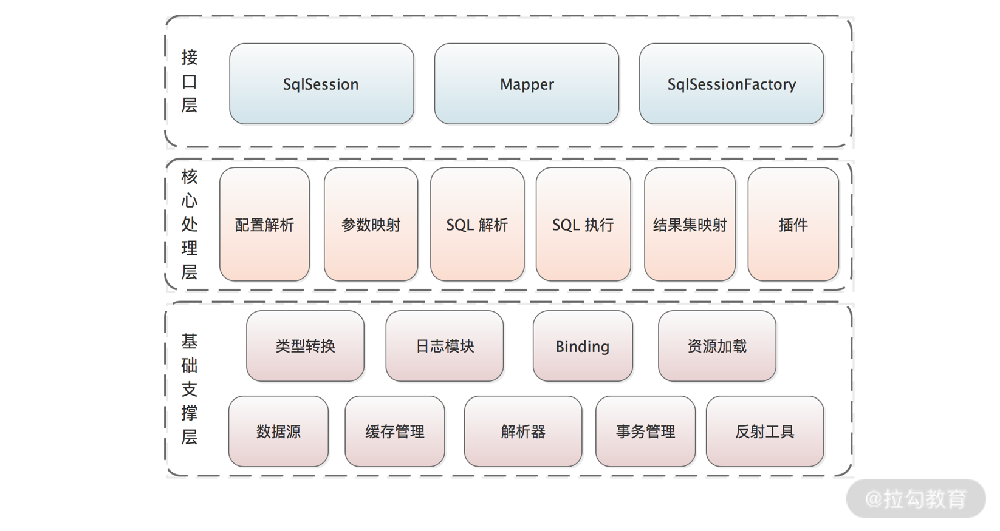

## 一、MyBatis整体架构解析

`MyBatis`分为三层架构，分别为**基础支撑层**、**核心处理层**、**接口层**

### 1.1 基础支撑层

> 基础支撑层是整个MyBatis框架的地基，为整个MyBatis框架提供了非常基础的功能

- **类型转换模块**：别名机制、实现MyBatis中JDBC类型和Java类型之间的转换
- **日志模块**：用来集成Java生态中的第三方日志框架，如`Log4j`、`Log4j2`、`slf4j`等
- **反射工具模块**：在Java反射的基础之上进行的一层封装，为上层使用方提供更加灵活、方便的API接口，同时缓存Java的原生反射相关的元数据，提升反射代码执行的效率，优化反射操作的性能
- **Binding模块**：通过该模块可以自动生成`Mapper`接口的动态代理对象，然后通过这个代理对象执行关联`Mapper.xml`文件中的数据库操作，通过这种方式，可以将一些错误提前到编译期。
- **数据源模块**：持久层框架的核心组件，一款性能出众的数据源可以成倍提升系统性能。MyBatis的数据源分为`UNPOOLED`（不使用连接池的数据源）、`POOLED`（使用连接池的数据源）、`JNDI`（使用JNDI实现的数据源）。[《深入理解mybatis原理》 Mybatis数据源与连接池](https://blog.csdn.net/luanlouis/article/details/37671851)

- **缓存模块**：持久层框架一般自带内置的缓存，MyBatis提供了一级缓存和二级缓存

- 解析器模块：MyBatis有两大配置文件，`mybatis-config.xml`和`Mapper.xml`配置文件，都是由解析器模块进行解析，依赖`XPath`实现`XML`配置文件以及各类表达式的高效解析
- **事务管理模块**：MyBatis对数据库中的事务进行了一层简单的抽象，提供了简单易用的事务接口和实现。一般情况下，Java项目都会集成Spring，并由Spring框架管理事务
- **资源加载**：

### 1.2 核心处理层

> 核心处理层是MyBatis的核心实现所在，其中涉及MyBatis的初始化以及执行一条SQL语句的全流程

- **配置解析**：在MyBatis初始化过程中，会加载`mybatis-config.xml`配置文件、`Mapper.xml`配置文件以及Mapper接口中的注解信息，并将解析之后得到的配置对象保存到`Configuration`对象中，如`<resultMap>`标签会被解析成`ResultMap`对象。利用得到的`Configuration`对象创建`SqlSessionFactory`对象，之后即可创建`SqlSession`对象执行数据库操作

- **SQL解析与Scripting模块**：实现MyBatis的动态SQL功能，如`<where>`、`<if>`、`<foreach>`标签等。MyBatis中的`scripting`模块就是负责动态生成SQL的核心模块，会根据运行时用户传入的实参，解析动态SQL中的标签，并形成SQL模板，然后处理SQL模板中的占位符，用运行的实参填充占位符，得到数据库真正可执行的SQL语句

- SQL执行：在 MyBatis 中，要执行一条 SQL 语句，会涉及非常多的组件，比较核心的有：`Executor`、`StatementHandler`、`ParameterHandler` 和 `ResultSetHandler`。

  其中，Executor 会调用事务管理模块实现事务的相关控制，同时会通过缓存模块管理一级缓存和二级缓存。SQL 语句的真正执行将会由 StatementHandler 实现。那具体是怎么完成的呢？StatementHandler 会先依赖 ParameterHandler 进行 SQL 模板的实参绑定，然后由 java.sql.Statement 对象将 SQL 语句以及绑定好的实参传到数据库执行，从数据库中拿到 ResultSet，最后，由 ResultSetHandler 将 ResultSet 映射成 Java 对象返回给调用方，这就是 SQL 执行模块的核心。

  

- **插件**：当框架原生能力不能满足某些场景的时候，就可以针对这些场景实现一些插件来满足需求，这样的框架才能有足够的生命力。这也是 MyBatis 插件接口存在的意义。

### 1.3 接口层

> 接口层是MyBatis暴露出来可调用的接口集合

 MyBatis 时最常用的一些接口，例如，`SqlSession` 接口、`SqlSessionFactory` 接口等。其中，最核心的是 `SqlSession` 接口，你可以通过它实现很多功能，例如，获取 `Mapper` 代理、执行 SQL 语句、控制事务开关等

