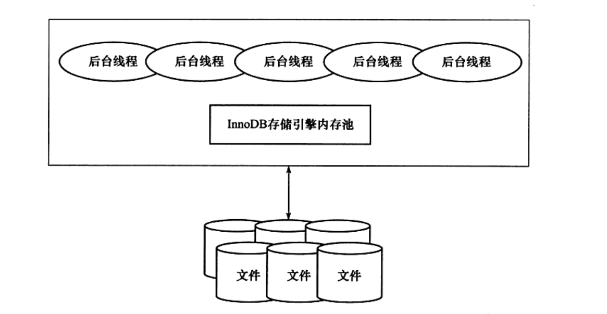
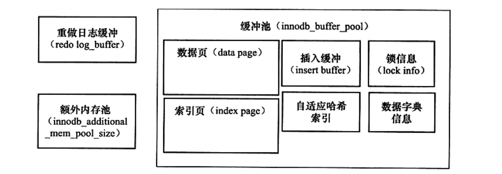

# MySQL
## 一、MySQL体系结构和存储引擎
### 1.1 定义数据库和实例
- **数据库**：物理操作系统文件或其他形式文件类型的集合
- **实例**：MySQL数据库由后台线程以及一个共享内存区组成，在系统上的表现，就是一个进程

> 数据库是由一个个文件组成的，要对这些文件执行诸如`SELECT`、`INSERT`、`UPDATE`和`DELETE`之类的数据库操作是不能通过简单的操作文件来更改数据库的内容，需要通过数据库实例来完成对数据库的操作。

## 1.2 MySQL体系结构

- 连接池组件（图中未体现）
- 管理服务和工具组件（图中未体现）
- SQL接口组件
- 查询分析器组件
- 优化器组件
- 缓冲组件
- 插件式存储引擎
- 物理文件

> 存储引擎是基于表的，而不是数据库

## 1.3 MySQL存储引擎

### 1.3.1 InnoDB存储引擎

- 支持事务，面向在线事务处理（OLTP）的应用
- 行锁设计
- 支持外键
- 支持非锁定读，即默认读取操作不会产生锁
- 通过多版本并发控制（MVCC）来或的高并发性
- 实现了SQL标准的四种隔离级别：`Read UnCommitted`、`Read committed`、`Repeatable Read`、`Serializable`，默认为`Repeatable Read`。使用`next-key locking`的策略避免幻读
- 提供了插入缓存（`insert buffer`）、二次写（`double write`）、自适应哈希索引、预读等高性能和高可用功能
- 表中数据的存储采用了聚集（`clustered`）的方式，按照主键顺序存放，若无主键，`InnoDB`会为每一行生成一个6字节的`ROWID`

### 1.3.2 MyISAM 存储引擎

- 不支持事务，面向一些联机分析处理（OLAP）应用
- 表锁设计
- 支持全文索引
- 缓冲池只缓冲索引文件，而不缓冲数据文件

> 此外还有`NDB`、`Memory`、`Archive`、`Federated`、`Maria`等存储引擎。MySQL数据库是开源的，用户可以根据MySQL预定义的存储引擎接口编写自己的存储引擎。

> 可以通过`show engines`命令查看当前使用的MySQL数据库所支持的存储引擎

## 二、InnoDB存储引擎

> - 第一个完整支持ACID事务的MySQL存储引擎
> - 行锁设计、支持MVCC、支持外键、提供一致性非锁定读

### 2.1 InnoDB体系结构

- InnoDB存储引擎有多个内存块组成了内存池，负责
  - 维护所有进程/线程需要访问的多个内部数据结构
  - 缓存磁盘上的数据，方便快速读取，同时在对磁盘文件的修改之前在这里缓存
  - 重做日志缓冲
  - ........
- 后台线程的作用
  - 刷新缓冲池中的数据，保证缓冲池中的数据缓存的是最近的数据
  - 将已修改的数据文件刷新到磁盘文件
  - 保证数据库发生异常的情况下InnoDB能恢复到正常情况

### 2.2 后台线程

1. **Master Thread**

   负责将缓冲池中的数据异步刷新到磁盘，保证数据一致性，包括脏页的刷新、合并插入缓冲、UNDO页的回收等

2. **IO Thread**

   InnoDB存储引擎大量使用`AIO`来处理IO请求，而`IO Thread`的工作主要就是负责这些IO请求的回调处理。

   4中`IO Thread`：write、read、insert buffer 和 log IO Thread

3. **Purge Thread**

   主要作用是用来回收事务提交后，不再使用的`undolog`

4. **Page Cleaner Thread**

   作用是刷新脏页，减轻原先`Master Thread`的工作及对于用户查询线程的阻塞

### 2.3 内存

1. **缓冲池**

   - 解决CPU与磁盘速度之间的鸿沟，提高数据库的整体性能
   - 读取页时，先在缓冲池中查找，若缓冲池没有，则读取磁盘
   - 修改页时，首先修改缓冲池中的页，然后再通过`Checkpoint`技术以一定频率刷新到磁盘中

   

   2. **LRU List、Free List、Flush List**

      - **LRU List**

        LRU算法（lastest recent used）最近最少使用算法。InnoDB对LRU算法进行了改进，增加了`midpoint`位置，新访问的页存放在`midpoint`位置，而不是LRU List的首部，这是为了防止将仅仅是某次查询操作（若索引和数据的扫描操作）访问了表中的大量页，导致大量热点数据从LRU列表中移除，而在下一次读取该页时，需要再次访问磁盘。

        `innodb_old_blocks_pct`：默认为37，控制`midpoint`的位置
        
        `innodb_old_blocks_time`：用于表示页读取到`midpoint`位置后需要等待多久才会被加入到LRU列表的热端
        
      - **Free List**

        数据库刚启动时，LRU列表时空的，所有的页都存放在`free list`中。当需要从缓冲池中分页时，首先从`Free`列表中查找是否有空闲的页，若有，则从`Free`列表中删除，放入到`LRU`列表中。否则，根据LRU算法，淘汰`LRU`列表末尾的页，将该内存空间分配给新的页。

        支持压缩页的操作，将原本`16KB`的页压缩为`1KB`、`2KB`、`4KB`和`8KB`。对于非`16KB`的页，通过`unzip_LRU`列表进行管理，`LRU`列表的页包含了`unzip_LRU`列表中的页

      - **Flush List**

        - 在LRU列表的页被修改后，称之为脏页，即缓冲池中页和磁盘中的页产生了不一致。这时数据库会通过`checkpoint`机制将脏页刷新到磁盘。

        - 脏页既存在于LRU列表中，也存在于Flush列表中。LRU列表用来管理缓冲池中页的可用性，Flush列表用来管理将页刷新回磁盘，两者互不影响

      - **重做日志缓冲**

        - InnoDB存储引擎首先将重做日志信息放入到重做日志缓冲中，然后按一定频率将其刷新到重做日志文件中。
        - 重做日志缓冲由参数`innodb_log_buffer_size`控制，默认为`8MB`，不需要设置的过大，只需要保证每秒产生的事务量尽量控制这个缓冲大小之内即可
        - 以下三种情况会将重做日志缓冲刷新到重做日志文件中
          - `Master Thread`每一秒将重做日志缓冲刷新到重做日志文件中
          - 每个事务提交时会将重做日志缓冲刷新到重做日志文件中
          - 当重做日志缓冲池剩余空间小于`1/2`时，重做日志缓冲刷新到重做日志文件中

      - **额外的内存池**

        - 在对一些数据结构本身的内存进行分配时，需要从额外的内存池中进行申请，若该区域的内存不够时，会从缓冲池中进行申请

### 2.4 CheckPoint技术

#### 2.4.1 什么是CheckPoint

- 事务数据库系统普遍采用`write ahead log`策略实现持久性，即当事务提交时，先写重做日志，再修改页。
- `CheckPoint`是一种让`redo`与`data`文件保持一致的机制。通过`LSN（Log Squence Number）`实现，日志序列号，一个不断增大的数字，表示`redo log`的增量。实例恢复时，假如`checkpoint LSN = 1000`，而`redoLSN = 1200`，则`LSN=[1001, 1200]`均需要重做。
  
#### 2.4.2 CheckPoint技术解决的问题

1. 缩短数据库的恢复时间
2. 缓冲池不够用时，将脏页刷新到磁盘
3. 重做日志不可用时，刷新脏页
   
#### 2.4.3 CheckPoint刷新的时机

- **Sharp CheckPoint**：在数据库关闭时将所有的脏页刷新到磁盘，默认的工作方式
- **Fuzzy CheckPoint**：在数据库运行期间，刷新一部分脏页，而不是刷新所有的脏页
- **Master Thread CheckPoint**：以每秒或每十秒的速度异步从缓冲池的脏页列表中异步刷新一定比例的页回磁盘
- **FLUSH_LRU_LIST CheckPoint**：InnoDB需要保证`LRU List`中由差不多100个空闲页可供使用，若无100个空闲页时，InnoDB会将尾端的页移除，若移除的页中包含脏页，则需要进行`CheckPoint`。目前放在单独的一个`Page Cleaner`线程中进行
- **Async/Sync Flush CheckPoint**：在重做日志不可用时，将一些脏页强制刷新回磁盘，放到单独的线程`Page Cleaner`中进行
- **Dirty Page too much CheckPoint**：脏页的数量太多时触发，其目的总的来说是为了保证缓冲池中由足够可用的页
  
### 2.5 InnoDB关键特性

> - 插入缓存
> - 两次写
> - 自适应哈希索引
> - 异步IO
> - 刷新邻近页

#### 2.5.1 插入缓冲

