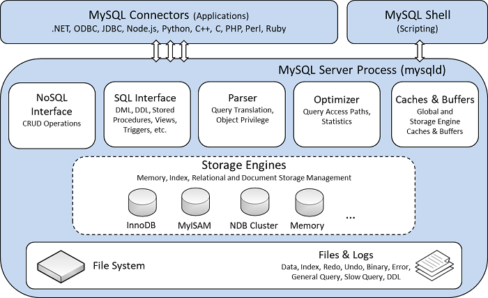

# MySQL
## 一、MySQL体系结构和存储引擎
### 1.1 定义数据库和实例
- **数据库**：物理操作系统文件或其他形式文件类型的集合
- **实例**：MySQL数据库由后台线程以及一个共享内存区组成，在系统上的表现，就是一个进程

> 数据库是由一个个文件组成的，要对这些文件执行诸如`SELECT`、`INSERT`、`UPDATE`和`DELETE`之类的数据库操作是不能通过简单的操作文件来更改数据库的内容，需要通过数据库实例来完成对数据库的操作。

## 1.2 MySQL体系结构

- 连接池组件（图中未体现）
- 管理服务和工具组件（图中未体现）
- SQL接口组件
- 查询分析器组件
- 优化器组件
- 缓冲组件
- 插件式存储引擎
- 物理文件

> 存储引擎是基于表的，而不是数据库

## 1.3 MySQL存储引擎

### 1.3.1 InnoDB存储引擎

- 支持事务，面向在线事务处理（OLTP）的应用
- 行锁设计
- 支持外键
- 支持非锁定读，即默认读取操作不会产生锁
- 通过多版本并发控制（MVCC）来或的高并发性
- 实现了SQL标准的四种隔离级别：`Read UnCommitted`、`Read committed`、`Repeatable Read`、`Serializable`，默认为`Repeatable Read`。使用`next-key locking`的策略避免幻读
- 提供了插入缓存（`insert buffer`）、二次写（`double write`）、自适应哈希索引、预读等高性能和高可用功能
- 表中数据的存储采用了聚集（`clustered`）的方式，按照主键顺序存放，若无主键，`InnoDB`会为每一行生成一个6字节的`ROWID`

### 1.3.2 MyISAM 存储引擎

- 不支持事务，面向一些联机分析处理（OLAP）应用
- 表锁设计
- 支持全文索引
- 缓冲池只缓冲索引文件，而不缓冲数据文件

> 此外还有`NDB`、`Memory`、`Archive`、`Federated`、`Maria`等存储引擎。MySQL数据库是开源的，用户可以根据MySQL预定义的存储引擎接口编写自己的存储引擎。

> 可以通过`show engines`命令查看当前使用的MySQL数据库所支持的存储引擎

## 二、InnoDB存储引擎

