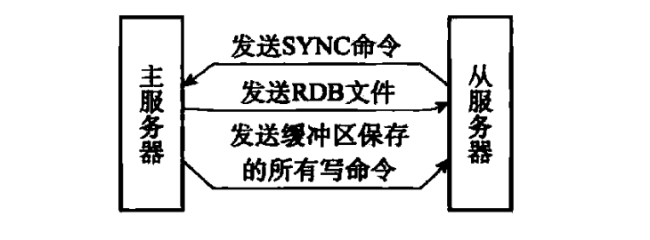
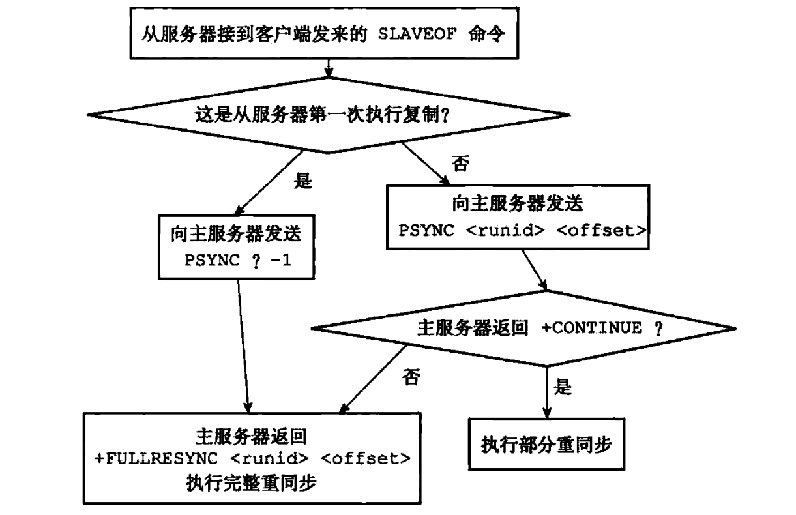
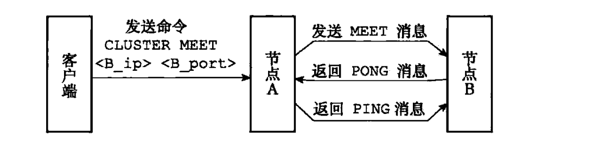
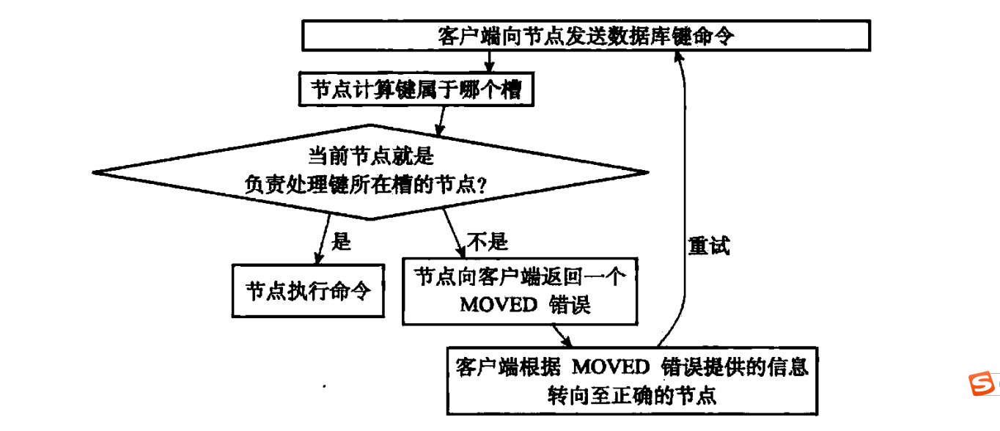
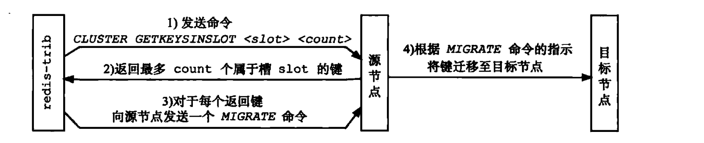

# Redis
## 一、简单动态字符串
### 1.1 数据结构
```C
struct sdshdr {
	// 记录buf数组中已使用字节的数量
	// 等于SDS所保存字符串的长度
	int len;
	// 记录buf数组中未使用字节的数量
	int free;
	// 字节数组，用于保存字符串
	char buf[];
}
```
### 1.2 SDS与C字符串的区别
1. 常数复杂度获取字符串长度
2. 杜绝缓冲区溢出
3. 减少修改字符串时带来的内存重分配次数
	- 空间预分配
		- 修改后`len`属性小于1MB，则分配和len属性同样大小的未使用空间
		- 修改后`len`属性大于1MB，则分配1MB的未使用空间
    - 惰性空间释放
4. 二进制安全，SDS可以保存文本或二进制数据，C字符串只能保存文本
5. 兼容部分C字符串函数

## 二、链表
### 2.1 数据结构
#### 2.1.1 链表节点
```C
type struct listNode {
	// 前置节点
	struct listNode *prev;
	// 后置节点
	struct listNode *next;
	// 节点的值
	void *value;
}listNode;
```
#### 2.1.2 链表

```C
typedef struct list{
	// 表头节点
	listNode *head;
	// 表尾节点
	listNode *tail;
	// 链表所包含的节点数量
	unsigned long len;
	// 节点值复制函数
	void *(*dup) (void *ptr);
	// 节点值释放函数
	void (*free) (void *ptr);
	// 节点值对比函数
	int (*match)(void *ptr,void *key);
}list;
```
### 2.2 特性
1. **双端**：链表节点带有prev和next指针，获取某个节点的前置后置节点复杂度都是O(1)
2. **无环**：表头节点的prev和表尾节点的next指针都指向NULL，对链表的访问以NULL为终点
3. **带表头指针和表尾指针**：通过list结构的head指针和tail指针，程序获取链表的表头节点和表尾节点的复杂度为O(1)
4. **带链表长度计数器**：程序使用list结构的len属性来对list持有的链表节点进行计数，程序获取链表中节点数量的复杂度为O(1)
5. **多态**：链表节点使用void*指针来保存节点值，并且可以通过list结构的dup、free、match三个属性为节点值设置类型特定函数，所以链表可以用于保存不同类型的值

## 三、字典

### 3.1 数据结构

#### 3.1.1 哈希表节点
```C
typedef struct dictEntry{
	// 键
	void *key;
	
	// 值
	union{
		void *val;
		uint64_tu64;
		int64_ts64;
	} v;
	
	// 指向下个哈希表节点，形成链表
	struct dictEntry *next;
} dictEntry;
```

#### 3.1.2 哈希表
```C
typedef struct dictht{
	// 哈希表数组
	dictEntry **table;
	
	// 哈希表大小
	unsigned long size;
	
	// 哈希表大小掩码，用于计算索引值
	// 总是等于 size - 1
	unsigned long sizemask;
	
	// 该哈希表已有节点数量
	unsigned long used;
} dictht;
```

#### 3.1.3 字典
```C
typedef struct dict{
	// 类型特定函数
	dictType *type;
	
	// 私有数据
	void *privdata;
	
	// 哈希表
	dictht ht[2];
	
	// rehash索引
	// 当 rehash 不在进行时，值为-1
	int rehashidx;
}
```

### 3.2 hash算法
使用特定类型的`hash函数`对`key`求hash值，然后再用值与`dictht的掩码`做`位与`运算

### 3.3 键冲突
采用`链地址`，将新添加的与已有键值对冲突的放在链表的首部，因为没有指向链表尾部的指针，所以放在首部，时间复杂度为O(1)

### 3.4 哈希表扩展和收缩的时机
1. 扩展
	- 服务器未进行`BGSAVE`或`BGREWRITEAOF`时，负载因子大于等于1
	- 服务器进行`BGSAVE`或`BGREWRITEAOF`时，负载因子大于等于5
2. 收缩
	- 当负载因子小于0.1时，哈希表执行收缩操作

**负载因子公式：**`ht[0].used / ht[0].size`

### 3.5 渐进式rehash
- 避免`rehash`对服务器性能造成影响，服务器分多次、渐进式地将`ht[0]`里面的键值对慢慢地`rehash`到`ht[1]`
- 步骤
	1. 为ht[1]分配空间，让字典同时持有ht[0]和ht[1]两个哈希表
	2. 字典中维护索引计数器`rehashindex`，将其值设置为0，表示rehash开始
	3. rehash期间，每次对字典进行添加、删除、查找或更新，程序除执行指定操作，还会将ht[0]哈希表中rehashindex索引上的所有键值对rehash到ht[1]
	4. 在某个时间点，ht[0]的所有键值对都会被rehash到ht[1]，这时`rehashindex`置为-1，表示rehash结束

## 四、 跳跃表

### 4.1 数据结构
#### 4.1.1 跳跃表节点
```C
typedef struct zskiplistNode{
	// 层
	struct zskiplistLevel{
		// 前进指针
		struct zskiplistNode *forward;
		// 跨度
		unsigned int span;
	} level[];
	// 后退指针
	struct zskiplistNode *backward;
	// 分值
	double score;
	// 成员对象
	robj *obj;
}zskiplistNode;
```

#### 4.1.2 跳跃表
```C
typedef struct zskiplist{
	// 表头节点和表尾节点
	struct skiplistNode *header, *tail;
	// 表中节点的数量，表头节点不计算在内
	unsigned long length;
	// 表中层数最大的节点的层数，不包含表头节点
	int level;
}zskiplist;
```
1. `header`：指向跳跃表的表头节点
2. `tail`：指向跳跃表的表尾节点
3. `level`：记录目前跳跃表内，除表头节点外层数最大的节点层数
4. `length`：记录跳跃表目前包含节点（表头节点不计算在内）的数量

### 4.2 特性
1. 有序数据结构，在每个节点中维持多个指向其他节点的指针，从而达到快速访问节点的目的。支持平均`O(logN)`、最坏`O(N)`复杂度的节点查找。有序集合键的底层实现之一。
2. 每个跳跃表的层高都是1至32之间的随机数
3. 跳跃表节点按分值大小排序，当分值相同时，节点按照成员对象的大小进行排序
### 4.3 查找


**查找19**
1. 从头结点开始，首先跟`23`比较
2. `19`小于`23`，降一层，找到`9`
3. 大于`9`，查找指针再往前走一步和`23`比较，小于`23`，查找指针到下一层继续查找。
4. 然后和`13`进行推断。大于`13`，查找指针再往前走一步和`23`比較，小于`23`，（此时查找指针在图中“3”位置处）此时这个值肯定在`13`结点和`23`结点之间。查找指针到下一层继续查找。
5. 此时，我们和`19`进行推断。找到了。

## 五、整数集合
- 集合键的底层实现之一，当集合只包含整数值元素，且数量不多时，Redis使用整数集合作为集合键的底层实现
- 集合中元素有序，不重复

### 5.1 数据结构
```C
	typedef struct intset{
		// 编码方式，由该属性确定 contents 数组元素的类型
		uint32_t encoding;
		// 集合包含的元素数量
		uint32_t length;
		// 保存元素的数组
		int8_t contents[];
	}intset;
```
### 5.2 升级
当将一个新元素添加到整数集合里面，并且新元素的类型比整数集合现有所有元素的类型都要长时，整数集合需要先进行升级，然后才能将新元素添加到整数集合里面。

**升级步骤**
1. 根据新元素类型，扩展整数集合底层数组的空间大小，并为新元素分配空间
2. 将底层数组现有的所有元素都转换成与新元素相同的类型，并将类型转换后的元素放置到正确的位置上，保证底层数组的有序性不变
3. 将新元素添加到底层数组里面

**升级的好处**
-  提升灵活性
-  节约内存

### 5.3 降级
整数集合不支持降级操作

## 六、压缩列表
- 压缩列表（`ziplist`）是列表键和哈希键的底层实现之一。当列表键只包含少量列表项，且列表项要么是小整数、要么是长度短的字符串，使用`ziplist`；当哈希键只包含少量键值对，且每个键值对的键和值是小整数或长度短的字符串时，使用`ziplist`。
- 是`Redis`为节约内存开发的，由一系列特殊编码的连续内存块组成的顺序型数据结构。可包含任意多个节点，每个节点保存一个字节数组或者一个整数值。

### 6.1 压缩列表的构成


### 6.2 压缩列表的节点构成


- `previous_entry_length`：记录了压缩列表中前一个节点的长度，`previous_entry_length`长度可以是1字节或5字节。程序可通过指针运算，根据当前节点的起始地址来计算出前一个节点的起始地址。压缩列表的从表尾向表头遍历就是使用这一原理实现的。
- `encoding`：记录了节点的`content`属性所保存数据的类型以及长度
- `content`：负责保存节点的值，节点值可以是一个字节数组或者整数，值的类型和长度由节点的`encoding`属性决定

### 6.3 连锁更新
当新增或者删除节点时，有可能造成后一节点的`previous_entry_length`属性无法存储前一节点的长度，这个时候就需要更新后一节点的长度，同样，可能会影响后面的节点。

## 七、数据库
### 7.1 服务器中的数据库
```C
struct redisServer{
	// 一个数组，保存着服务器中的所有数据库
	redisDb *db;
	
	// 服务器的数据库数量，默认16
	int dbnum;
};

typedef struct redisClient{
	// 记录客户端当前正在使用的数据库
	redisDB *db;
} redisClient;
```
- 初始化服务器时，程序会根据服务器状态的`dbnum`属性来决定应该创建多少个数据库，该属性由服务器配置的`database`选项决定，默认为16
- `SELECT`命令的原理：通过修改`redisClient.db`指针，让它指向服务器中的不同数据库，从而实现切换目标数据库的功能

### 7.2 数据库键空间
```C
typedef struct redisDb{
	// 数据库键空间，保存着数据库中所有的键值对
	dict *dict;
} redisDb;
```
**数据库键空间例子**


- 数据库的键空间是一个字典，对数据库的新增键、删除键、获取键，以及`FLUSHDB`、`RANDOMMKEY`、`DBSIZE`命令等，实际上都是通过对键空间字典进行操作实现的
- 读写键空间时的维护操作
	- 根据键是否存在更新服务器的键空间命中`hit`次数或不命中`miss`次数
	- 更新键的`LRU`（最后一次使用时间），可用于计算键的闲置时间
	- 读取的键过期时，服务器会先删除这个过期键
	- 若该键被`WATCH`命令监控，服务器会标记该键为`dity`，从而让事务程序注意到这个键已经被修改过
	- 服务器每次修改一个键之后，都会对脏`dity`键计数器增1，这个计数器会触发服务器持久化及复制操作

### 7.3 设置键的生存时间或过期时间
```C
typedef struct redisDb{
	// 过期字典，保存着键的过期时间
	dict *expires;
} redisDb;
```

**带有过期时间的数据库示例**


- 设置过期时间有四种方式：
	- `EXPIRE`命令设置键的生存时间为多少秒
	- `PEXPIRE`命令设置键的生存时间为多少毫秒
	- `EXPIREAT`命令设置键在某一个秒单位时间戳过期
	- `PEXPIREAT`命令设置键在某一个毫秒单位时间戳过期
实际上以上四种方式都会转变为`PEXPIREAT`命令去设置键的过期时间
- `PERSIST`命令移除一个键的过期时间
- `TTL`命令返回以秒为单位的键剩余生存时间，`PTTL`命令则返回以毫秒为单位的键剩余时间

### 7.4 过期键删除策略
- 定时策略：在设置键的过期时间的同时，创建一个定时器，让定时器在键的过期时间来临时，理解删除键。对CPU时间不友好
- 惰性策略：每次从键空间获取键时，检索键是否过期，如果过期，就删除。对内存不友好
- 定期策略：每隔一段时间，程序对数据库进行检查，删除里面的过期键。难点是确定删除操作执行的时长和频率

- Redis服务器实际使用的是惰性删除和定期删除两种策略
- `SAVE`及`BGSAVE`命令生成RDB文件时，已过期的键不会保存在RDB文件中。主服务器载入RDB文件时，不会载入过期键，从服务器，会载入
- AOF文件写入时，若键过期，会向AOF文件追加一条`DEL`命令。AOF文件重写时，已过期的键不会保存在重写后的AOF文件中


## 八、RDB持久化

1. `RDB持久化`机制是为了解决`Redis`内存数据库在崩溃或所在服务器停机之后数据丢失的问题。通过`SAVE`或`BGSAVE`命令可以手动生成某一个时间点的`RDB`文件，也可以通过配置`Redis`配置文件`save`选项自动生成`RDB`文件。
2. `RDB`文件是一个经过压缩的二进制文件，由多个部分组成；对于不同类型键值对，`RDB`文件会使用不同的方式来保存他们。
3. `SAVE`命令会阻塞`Redis`服务器进程，直到`RDB`文件创建完毕为止，在服务器阻塞期间，服务器不能处理任何命令请求
4. `BGSAVE`命令会派生出一个子进程，然后由子进程负责创建`RDB`文件，服务器进程会继续处理命令请求
5. `RDB`文件的载入工作是在服务器启动时自动执行的，`AOF`持久化功能开启时，`AOF`文件载入优先级高于`RDB`文件
6. 在`BGSAVE`命令执行期间，服务器发送的`SAVE`、`BGSAVE`命令会被拒绝，防止产生竞争条件；`BGREWRITEAOF`命令会被延迟到`GBSAVE`命令执行完毕之后执行；在`BGREWRITEAOF`命令执行时，`BGSAVE`命令会被拒绝
7. `Redis`允许用户通过配置多个`save`选项或传入启动参数，让服务器每隔`100ms`自动执行`BGSAVE`命令，生成`RDB`文件。如`save 900 1`代表，服务器在900秒内，对数据库进行了至少一次的修改。
```C
struct redisServer {
	// 修改计数器
	long dirty;
	// 上一次执行保存的时间
	time_t lastsave;
};
```

## 九、AOF持久化
AOF持久化是通过保存Redis服务器所执行的写命令来记录数据库状态的。服务器在启动时，可以通过载入和执行AOF文件中保存的命令还原服务器关闭之前的数据库状态。

### 9.1 AOF持久化的实现
AOF持久化的实现可以分为命令追加、文件写入、文件同步三个步骤

#### 9.1.1 命令追加
服务器在执行完一个写命令之后，会以协议格式将被执行的写命令追加到服务器状态的`aof_buf`缓冲区的末尾

```C
struct redisServer{
	// AOF缓冲区
	sds aof_buf;
};
```

#### 9.1.2 AOF文件的写入和同步
- Redis的服务器进程就是一个事件循环，循环中的文件事件负责接收客户端的命令请求，以及向客户端发送命令回复。时间事件则负责执行像`serverCron`函数这样需要定时执行的函数。在服务器每次结束一个时间循环之前，都会调用`flushAppendOnlyFile`函数，根据服务器配置的`appendsync`选项的值来决定是否需要将`aof_buf`缓冲区中的内容写入和保存到AOF文件中。

**appendsync选项的值**
- `always`：将`aof_buf`缓冲区中的所有内容写入并同步到AOF文件中
- `everysec`：将`aof_buf`缓冲区中的内容写入到AOF文件中，若上次同步时间距离现在超过一秒钟，则对AOF文件进行同步，该同步操作由一个线程负责执行
- `no`：将`aof_buf`缓冲区中的内容写入到AOF文件中，是否同步由操作系统决定

### 9.2 AOF的载入和数据还原

**AOF文件载入过程**


### 9.3 AOF重写

- AOF持久化是通过保存被执行的写命令来记录数据库状态，随着服务器运行时间的流逝，AOF体积会越来越大，会对Redis服务器，甚至整个宿主机造成影响，且数据还原所需要的时间也会越来越多。
- AOF重写的实现原理，是读取当前数据库状态，然后用一条命令去记录键值对（当处理哈希表、集合、有序集合这四种带有多个元素的键值对时，若元素数量超过限制，会使用多条命令记录该键，防止客户输入缓冲区溢出），代替之前这个键值对的多条命令
- AOF后台重写`BGREWRITEAOF`命令的实现原理，创建一个子进程，同时，在子进程创建完成后，写入命令除了写入AOF缓冲区外，还会写入AOF重写缓冲区，因为AOF重写过程中，读取到的数据库状态可能与重写之后的数据库状态不一致，需要在AOF重写完成后，将AOF重写缓冲区中的内容写入新的AOF文件，才能保证数据库状态的一致性

## 十、复制

```
127.0.0.1:12345> SLAVEOF 127.0.0.1 6379
```

通过`SLAVEOF`命令或者设置`slaveof`选项，可以让一个服务器复制另一个服务器


### 10.1 旧版复制功能的实现

复制功能分为同步和命令传播两个操作：

- 同步操作用于将从服务器的数据库状态更新至主服务器当前的数据库状态
- 命令传播操作则用于在主服务器的数据库状态被修改，导致主从服务器的数据库状态出现不一致时，让主从服务器的状态重新回到一致状态

#### 10.1.1 同步

1. 从服务器向主服务器发送`SYNC`命令
2. 收到`SYNC`命令的主服务器执行`BGSAVE`命令，生成一个RDB文件，并使用一个缓冲区记录从现在开始执行的所有写命令
3. 当RDB文件生成后，主服务器会将该文件发送给从服务器，从服务器接收并载入该文件，将从服务器的状态更新至主服务器执行`BGSAVE`命令时的数据库状态
4. 主服务器将记录在缓冲区中的写命令发送给从服务器，从服务器执行这些写命令，将自己的数据库状态更新至主服务器数据库当前的状态





#### 10.1.2 命令传播

主服务器会将自己执行的写命令，也即是造成主从服务器不一致的那条写命令，发送给从服务器执行，主从服务器将再次回到一致状态


### 10.2 旧版复制功能的缺陷

旧版复制功能能够很好的完成初次复制任务，但是对于断线后重新连接的复制任务，却十分耗费资源，明明可以将断线期间的写命令进行同步即可达到数据库状态的一致性，但是却依然要载入全部的RDB文件，耗时耗资源


### 10.3 新版复制功能的实现

使用`PSYNC`命令代替`SYNC`命令


### 10.4 新版部分重同步的实现

由以下三部分组成：

1. 主服务器的复制偏移量和从服务器的复制偏移量
2. 主服务器的复制积压缓冲区
3. 服务器的运行ID


#### 10.4.1 复制偏移量

执行复制的双方——主服务器和从服务器会分别维护一个复制偏移量：

- 主服务器每次向从服务器传播N个字节的数据时，就将自己的复制偏移量的值加N
- 从服务器每次收到主服务器传播来的N个字节的数据时，就将自己的复制偏移量的值加N

通过复制偏移量就能知道主从服务器是否处于一致的状态


#### 10.4.2 复制积压缓冲区

复制积压缓冲区是由主服务器维护的一个固定长度先进先出的队列，默认大小为1MB

当主服务器进行命令传播时，不仅会将写命令发送给所有从服务器，还会将命令入队到复制积压缓冲区里面。复制积压缓冲区会为队列中的每个字节记录相应的复制偏移量。

当从服务器重新连上主服务器后，从服务器会通过`PSYNC`命令将自己的复制偏移量`offset`发送给主服务器，主服务器会根据这个复制偏移量来决定对从服务器执行何种同步操作


#### 10.4.3 服务器运行ID

每个Redis服务器，不管是主服务器还是从服务器，都会有一个由40个随机的十六进制字符组成的运行ID

从服务器对主服务器进行初次复制时，主服务器会将自己的运行ID传送给从服务器，从服务器会进行保存。当从服务器对主服务器进行复制（包括断线重连），都会传递主服务器ID，主服务器通过主服务器ID判断是否是初次连接。


### 10.5 PSYNC命令实现




### 10.6 复制的实现

1. 设置主服务器的地址和端口
2. 建立套接字连接
3. 发送PING命令
4. 身份验证
5. 发送端口信息
6. 同步
7. 命令传播
8. 心跳检测


## 十一、哨兵


## 十二、集群

Redis提供的分布式数据库解决方案，集群通过分片来进行数据共享，并提供复制和故障转移的功能


### 12.1 节点

一个Redis集群通常由多个节点组成，刚开始时，每个节点都是相互独立的，都处于一个只包含自己的集群当中。

连接各个节点的工作可以使用`CLUSTER MEET`命令来完成，命令格式如下：

```
CLUSTER MEET <ip> <port>

# 向一个节点node发送CLUSTER MEET 命令，可以让node节点与ip和port所指定的节点进行握手，握手成功时，node节点就会将ip和port所指定的节点添加到node节点当前所在的集群中
```

#### 12.1.1 启动节点

Redis服务器在启动时会根据`cluster-enable`配置选项是否为`yes`来决定是否开启服务器的集群模式。

集群模式下，节点将只有在集群模式下用到的数据保存到`cluster.h/clusterNode`结构、`cluster.h/clusterLink`结构、`cluster.h/clusterState`结构中。


#### 12.1.2 集群数据结构

`clusterNode`结构保存了一个节点的当前状态，比如节点的创建时间、节点的名字、节点当前的配置纪元、节点的IP地址和端口号等，其中`link`属性是一个`clusterLink`结构，保存了连接节点所需的各种信息，比如套接字描述符，输入缓冲区和输出缓冲区。

```c
struct clusterNode{
	// 创建节点的时间
	mstime_t ctime;
	
	// 节点的名字
	char name[REDIS_CLUSTER_NAMELEN];
	
	// 节点标识（标识节点角色，如主或从节点，标识节点状态，如上线或下线）
	int flags;
	
	// 节点当前的配置纪元，用于实现故障转移
	uint64_t configEpoch;
	
	// 节点的IP地址
	char ip[REDISE_IP_STR_LEN];
	
	// 节点的端口号
	int port;
	
	// 保存连接节点所需的有关信息
	clusterLink *link;
	
	//...
};

typedef struct clusterLink{
	// 连接创建时间
	mstime_t ctime;
	
	// TCP套接字描述符
	int fd;
	
	// 输出缓冲区，保存着等待发送给其他节点的消息
	sds sndbuf;
	
	// 输入缓冲区，保存着从其他节点接收到的消息
	sds rcvbuf;
	
	// 与这个连接相关联的节点，如果没有的话就为NULL
	struct clusterNode *node;
	
}clusterLink;
```


每个节点都保存着一个`clusterState`结构，记录当前节点视角下，集群目前所处的状态，例如集群是在线还是下线、集群包含多少个节点，集群当前的配置纪元等。

```C
typedef struct clusterState{
    // 指向当前节点的指针
    clusterNode *myself;
    
    // 集群当前的配置纪元，用于故障转移
    uint64_t currentEpoch;
    
    // 集群当前的状态，是上线还是下线
    int state;
    
    // 集群中至少处理这一个槽的节点数量
    int size;
    
    // 集群节点名单
    dict *nodes;
    
    //...
}clusterState;
```


#### 12.1.3 CLUSTER MEET命令的实现

`CLUSTER MEET <ip> <port>`

节点A为收到命令的节点，节点B为ip、port代表的节点，过程如下：

1. 节点A为节点B创建一个`clusterNode`结构，并将该结构添加到自己的`clusterState.nodes`字典里面
2. 节点A向节点B发送一个`MEET`消息
3. 节点B收到节点A发出的`MEET`消息，节点B为节点A创建一个`clusterNode`结构，并将该结构添加到自己的`clusterState.nodes`字典里面。
4. 节点B向节点A返回一条`PONG`消息
5. 节点A收到节点B返回的`PONG`消息，知道节点B已经成功接收到自己发送的`MEET`消息
6. 节点A向节点B发送一条`PING`消息
7. 节点B收到节点A发送的`PING`消息，知道节点A已经成功收到自己返回的`PONG`消息，握手完成
8. 之后，节点A会将节点B的信息通过`Gossip`协议传播给集群中的其他节点，让其他节点与节点B进行握手，最终，节点B会被集群中的所有节点认识




### 12.2 槽指派

集群的整个数据库被分为16384个槽，数据库中的每个键都属于这16384个槽的其中一个，集群中的每个节点可以处理0个或者最多16384个槽。

当16384个槽都有节点处理时，集群处于上线状态，否则，处于下线状态。

```
CLUSTER ADDSLOTS <slot> [slot ...]

// 将一个或多个槽指派给节点负责
```


#### 12.2.1 记录节点的槽指派信息

`clusterNode`结构中的`slots`属性和`numslots`属性记录了节点负责处理哪些槽：

```c
struct clusterNode{
    // ...
    
    unsigned char slots[16384/8];
    
    int numslots;
    
    // ...
}
```

`slots`属性是一个二进制位数组，以0为起始索引，16383为终止索引，若索引对应二进制位为1，则代表该节点负责处理，否则不处理。

对于程序检查节点是否处理某个槽，或者将某个槽指派给节点负责，这两个动作的复杂度都是O(1)


#### 12.2.2 传播节点的槽指派信息

一个节点除了会将自己负责处理的槽记录在`clusterNode.slots`外，还会将自己的`slots`数组通过消息发送给集群中的其他节点，以此来告知其他节点自己目前负责处理哪些槽。其他节点会在自己记录的`clusterState.nodes`字典中查找节点B对应的`clusterNode`结构，并将结构中对应的`slots`数组进行保存或者更新。


#### 12.2.3 记录集群所有槽的指派信息

`clusterState`的`slots`数组记录了集群中所有16384个槽的指派信息，每个数组项都指向一个`clusterNode`结构。

存储在`clusterState.slots`中是为了解决以下问题：

1. 为了快速知道槽`i`是否被指派，或者槽`i`指派给了哪个节点

存储在`clusterNode.slots`中是为了解决以下问题：

1. 当程序需要将某个节点的槽指派信息通过消息发送给其他节点时，程序只需要将`clusterNode.slots`数组整个发送出去就可以了，否则，需要遍历`clusterState.slots`，找到节点处理的槽信息，才能发送出去。


#### 12.2.4 CLUSTER ADDSLOTS命令的实现

设置`clusterState.slots`属性及`clusterNode.slots`属性，若其中一个槽已经指派了节点，则直接返回失败。


### 12.3 在集群中执行命令




#### 12.3.1 计算键属于哪个槽

`CRC16(key) & 16383`

计算键的CRC-16校验和，然后与16383进行与运算


### 12.4 重新分片

Redis集群的重新分片操作可以将任意数量已经指派给某个节点的槽改派给另一个节点，并且相关槽所属的键值对也会从源节点被移动到目标节点。可在线进行，不需要下线，且源节点和目标节点都可以继续处理命令请求。


Redis提供了重新分片所需的所有命令，而集群管理软件`redis-trib`则通过向源节点和目标节点发送命令来进行重新分片操作：

1. `redis-trib`向目标节点发送`CLUSTER SETSLOT <slot> IMPORTING <source_id>`命令，让目标节点准备好从源节点导入属于槽slot的键值对
2. `redis-trib`向源节点发送`CLUSTER SETSLOT <slot> MIGRATING <target_id>`命令，让源节点准备好将属于槽slot的键值对迁移至目标节点
3. `redis-trib`向源节点发送`CLUSTER GETKEYSINSLOT <slot> <count>`命令，获得最多`count`个属于槽的键值对的键名
4. 对于步骤3获得的每个键名，`redis-trib`都向源节点发送一个`MIGRATE <target_id> <target_port> <key_name> 0 <timeout>`命令，将被选中的键原子的从源节点迁移到目标节点
5. 重新执行步骤3和步骤4，直到所有键值对迁移完毕
6. `redis-trib`向任意一个节点发送`CLUSTER SETSLOT <slot> NODE <target_id>`命令，将槽指派给目标节点，这一指派信息会通过消息发送给整个集群，最终集群中的所有节点都知道槽已经指派给了目标节点



### 12.5 ASK错误

重分片期间，属于被迁移槽的一部分键值对保存在源节点里面，另一部分键值对保存在目标节点里面。当客户端向源节点发送一个与数据库有关的命令，并且命令要处理的数据库键恰好就属于正在被迁移的槽时，若源节点未能在自己的数据库里面找到指定的键，源节点会向客户端发送一个`ASK`错误，引导客户端转向正在导入槽的目标节点，并再次发送之前想要执行的命令。


#### 12.5.1 CLUSTER SETSLOT IMPORTING命令的实现

`clusterState`结构的`importint_slots_from`数组记录了当前节点正在从其他节点导入的槽

```c
typedef struct clusterState{
    // ...
    
    clusterNode *importing_slots_from[16384];
    
    // ...
}clusterState;

# 如果 importing_slots_from[i] 的值不为NULL，而是指向一个 clusterNode 结构，那么表示当前节点正在从 clusterNode 所代表的节点导入槽 i
```


#### 12.5.2 CLUSTER SETSLOTS MIGRATING命令的实现

`clusterState`结构的`migrating_slots_to`数组记录了当前节点正在迁移至其他节点的槽：

```c
typedef struct clusterState{
    // ...
    
    clusterNode *migrating_slots_to[16384];
    
    // ...
}clusterState;

# 如果 migrating_slots_to[i] 的值不为NULL，而是指向一个 clusterNode 结构，那么表示当前节点正在将槽 i 迁移至 clusterNode 所代表的节点
```


#### 12.5.3 ASK错误和MOVED错误的区别

`MOVED`：代表槽的负责权已经从一个节点转移到了另一个节点，在客户端收到关于槽`i`的`MOVED`错误之后，客户端每次遇到关于槽`i`的命令请求时，都可以直接将命令请求直接发送至`MOVED`错误所指向的节点。

`ASK`：ASK错误只是两个节点在迁移槽的过程中使用的一种临时错误，在客户端收到槽`i`的`ASK`错误之后，客户端只会在接下来的一次命令请求中将关于槽`i`的命令请求发送给`ASK`错误所指示的节点，但这种转向不会对客户端今后发送槽`i`的命令请求产生任何影响。


### 12.6 复制和故障转移

