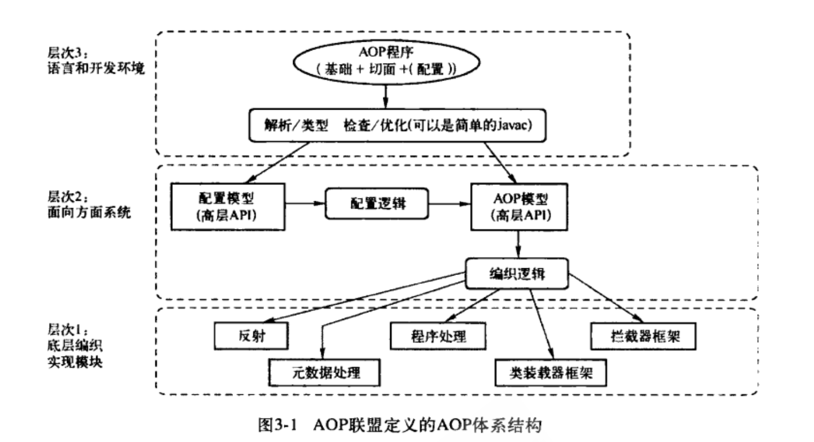
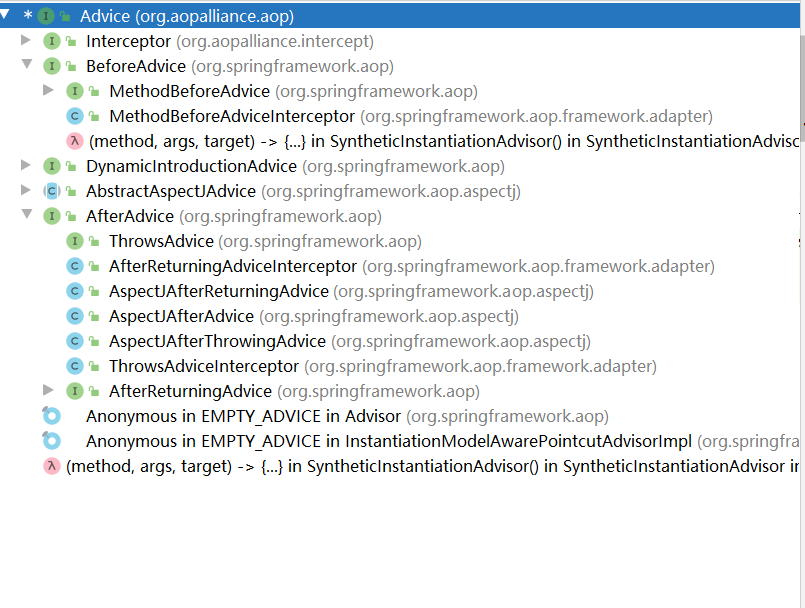
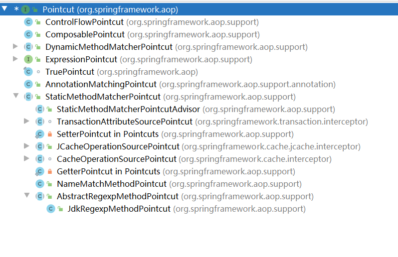

## 三、Spring AOP的实现

### 3.1 概述

#### 3.1.1 AOP概念

*AOP（Aspect-Oriented Programming）（面向方面编程或面向切面）*


**常见AOP技术**：

- **AspectJ**：源代码和字节码级别的编织器，用户需要使用不同于Java的新语言
- **AspectWerkz**：使用动态字节码动态编织器和XML配置
- **JBoss-AOP**：基于拦截器和元数据的AOP框架，运行在JBoss应用服务器上
- **BCEL**：Java字节码操作类库
- **Javassist**：Java字节码操作类库，JBoss子项目


**AOP体系结构：**




AOP体系结构将AOP相关的概念大致分为由高到低、从使用到实现的三个层次：

1. **语言和开发环境**

   - **基础（base）**：待增强对象或目标对象
   - **切面（aspect）**：增强应用
   - **配置（configuration）**：编织。通过在AOP体系中提供这个配置环境，可以将基础和切面结合起来，完成切面对目标对象的编织实现

2. **面向方面系统**

   为语言和开发环境提供支持，主要包括配置和编织实现两部分内容。例如配置逻辑和编织逻辑实现本身，以及对这些实现进行抽象的一些高层API，这些实现和API封装，为前面提到的语言和开发环境的实现提供了有力的支持。

3. **编织的具体实现**

   编织的具体实现模块，可以使用反射、程序预处理、拦截器框架、类装载器框架、元数据处理等实现编织逻辑。Spring AOP中，使用的是Java本身的语言特性，如Java Proxy代理类、拦截器技术，来实现AOP的编织。

#### 3.1.2 Advice通知

`Advice`（通知）定义在连接点做什么，为切面增强提供织入接口。主要描述Spring AOP围绕方法调用而注入的切面行为。

`Advice`是AOP联盟定义的一个接口，具体接口定义在`org.aopalliance.aop.Advice`中。使用这个统一接口，Spring提供了更具体的通知类型，如`BeforeAdvice`、`AfterAdvice`、`ThrowsAdvice`等。


**类层次关系图**：



#### 3.1.3 Pointcut切点

`Pointcut`（切点）决定`Advice`通知应该作用于哪个连接点，通过`Pointcut`来定义需要增强的方法的集合，`Pointcut`通常意味着标识方法。


**类层次关系图**：



```java

package org.springframework.aop;

public interface Pointcut {


	ClassFilter getClassFilter();

	MethodMatcher getMethodMatcher();


	Pointcut TRUE = TruePointcut.INSTANCE;

}
```

`Pointcut`实现类需要返回一个`MethodMatcher`，由这个`MethodMatcher`来判断是否需要对当前的方法调用进行增强，或者是否需要对当前调用方法应用配置好的`Advice`通知。可阅读`JdkRegexpMethodPointcut`了解`Pointcut`的工作原理。


#### 3.1.4 Advisor通知器

通过`Advisor`，可以定义应该使用哪个通知并在哪个关注点使用它。


### 3.2 Spring AOP的设计和实现

#### 3.2.1 JVM的动态代理特性


